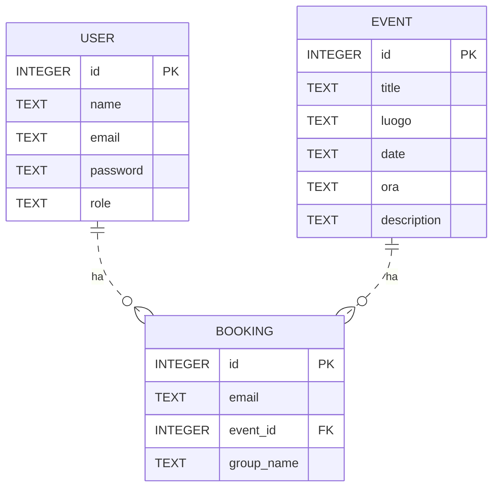
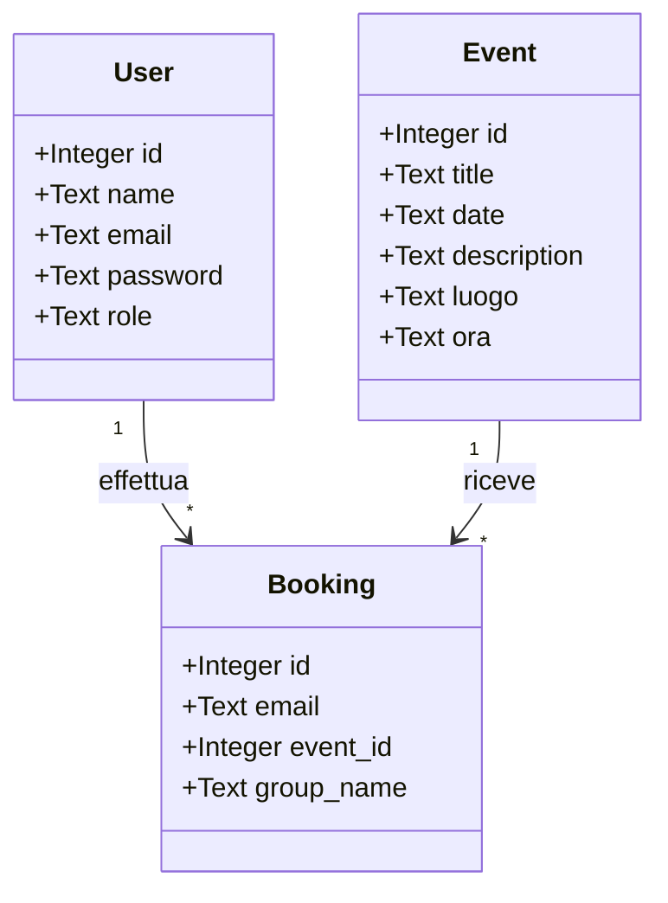

# 📘 School Booking App

Un'applicazione web realizzata con **Flask** e **SQLite** per la gestione di eventi scolastici, prenotazioni e autenticazione utenti (studenti e professori).

---

## 🚀 Funzionalità principali

- Registrazione e login per studenti e professori
- Prenotazione e annullamento eventi per studenti
- Creazione e cancellazione eventi per professori (con luogo, data, ora, descrizione)
- Visualizzazione calendario eventi
- Dashboard personale con prenotazioni
- Interfaccia web responsive (Flask + Jinja2)
- Database SQLite persistente

---

## 🏗 Architettura del progetto

Il progetto segue una struttura semplice e modulare:

```
school_booking_app/
├── school_booking_app.py      # Applicazione Flask principale
├── school_booking.db          # Database SQLite
├── school_booking.sql         # Script SQL per creazione DB
├── er_diagram.txt             # Diagramma ER (Mermaid)
├── requirements.txt           # Dipendenze Python
├── static/
│   └── booking.css            # Stili CSS
├── templates/
│   ├── welcome.html           # Pagina di benvenuto
│   ├── auth.html              # Login/registrazione
│   └── calendario.html        # Calendario e gestione eventi
└── README.md                  # Questo file
```

---

## 🗃 Modello ER



---

## 🧩 UML delle Classi





## ▶️ Esempio di utilizzo

```bash
# Clona il repository
git clone https://github.com/tuo-utente/school_booking_app.git
cd school_booking_app

# Installa le dipendenze
pip install -r requirements.txt

# (Facoltativo) Crea il database da SQL
sqlite3 school_booking.db < school_booking.sql

# Avvia il server Flask
python3 school_booking_app.py
```

Apri il browser su [http://127.0.0.1:5000](http://127.0.0.1:5000)

---

## ⚙️ Installazione e configurazione

- Nessuna configurazione particolare richiesta.
- Il database viene creato automaticamente al primo avvio.
- Puoi modificare la chiave segreta in `school_booking_app.py`.

---

## Eventi predefiniti

Per migliorare l'esperienza utente, il sistema carica automaticamente una serie di eventi di esempio nel database alla prima esecuzione, se la tabella degli eventi è vuota. In questo modo, la pagina del calendario mostra subito una lista di eventi disponibili, senza doverli inserire manualmente. Questo risolve il problema iniziale in cui la pagina era vuota finché non venivano creati manualmente degli eventi.

---

## Gestione eventi

Attualmente il sistema consente di aggiungere nuovi eventi tramite l’apposito modulo, specificando titolo, luogo, data, ora e descrizione. Tuttavia, la funzionalità che permette di vedere nell’interfaccia la lista degli eventi inseriti non è ancora presente: gli eventi creati vengono salvati nel database ma non sono ancora mostrati nella pagina. Questa caratteristica sarà sviluppata e integrata in una prossima versione, così da offrire una panoramica completa degli eventi sia predefiniti che aggiunti dagli utenti.

---

## 📦 Dipendenze

Installabili tramite `pip install -r requirements.txt`:

```
Flask==2.2.5
```

*(Solo Flask e SQLite della standard library, non serve Flask-SQLAlchemy)*

---

## 🔗 API Endpoints principali

- `/` → Pagina di benvenuto
- `/auth` → Login/registrazione
- `/calendario` → Calendario eventi (autenticato)
- `/prenota` → Prenotazione evento (POST)
- `/annulla_prenotazione` → Annulla prenotazione (POST)
- `/crea_evento` → Crea evento (POST, solo professore)
- `/elimina_evento` → Elimina evento (POST, solo professore)
- `/logout` → Logout

---

## 🛠 Tecnologie utilizzate

- Python 3.x
- Flask
- SQLite
- Jinja2
- HTML/CSS

---

## 👨‍💻 Autori

- [@massimiliano](https://github.com/massimiliano)  
- Contributi e suggerimenti sono benvenuti!

---

## 📄 Licenza

Questo progetto è distribuito sotto licenza MIT.